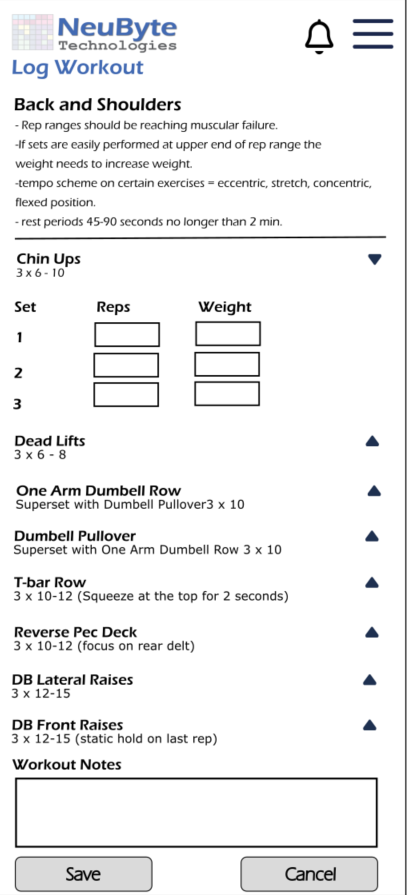

# 6.11 UIS-LW-01 Log Workout
## 6.11.1 Purpose
Allow the user to record the details of their completed workout for the current day, including sets, reps, weight, duration, distance, and rest periods as applicable. This enables accurate tracking of workout performance and progress over time.
## 6.11.4 Screen Layout — Log Workout
## 6.11.4.1 Layout Structure
**Header**
-	Standard authenticated header containing:
    -	NeuByte Logo (left)
    -	Notification Icon (right)
    -	Hamburger Menu (right)
-	Header remains fixed at the top
-	Back navigation uses OS native gesture or back button
-	Title is not required (Workout Detail already provides context)
**Body**
A vertically scrolling form that allows the user to log sets, reps, weight, duration, or other metrics for each exercise in the selected workout.
Elements:
-	Workout Title (Week/Day + Name)
-	Exercise List (scrollable) Each exercise includes:
    -	Exercise Name
    -	Set Rows (1 row per set)
        - Reps input
        - Weight input (optional)
        - Duration input (if applicable)
-	Workout Notes (optional text area)
-	Save Workout Button (primary action)
-	Cancel Button (secondary action)
-	Inline Error Label (appears only when validation fails)
**Footer**
-	App Version
-	Privacy Policy / Terms links
-	Copyright
## 6.11.4.3 Component Definitions
**Workout Title**
-	Bold, primary text
-	Includes program context (Week/Day)
- **Exercise Section**
Each exercise block contains:
-	Exercise Name (bold)
-	Set Rows
    - Reps input (numeric)
    - Weight input (numeric, optional)
    - Duration input (if exercise is time based)
**Workout Notes**
-	Optional text area
-	Multi line input
Save Workout Button
-	Primary action
-	Validates all inputs
-	Saves workout log
-	Returns user to Dashboard or Workout History
Cancel Button
-	Secondary action
-	Discards changes
-	Returns to previous screen
Inline Error Label
-	Appears only when validation fails
-	Uses global error banner pattern (UIS ERR 01)
## 6.11.4.4 Interaction Rules & Behaviors
**Initial Load**
-	App fetches the workout structure for the selected day:
    - Exercises
    - Expected number of sets per exercise
    - Exercise type (strength, timed, bodyweight, distance, etc.)
-	UI displays skeleton loaders until data is returned.
-	Each exercise loads in a collapsed state by default.
-	When the data is ready:
    - Pre‑populate exactly the number of sets defined by the program.
    - No additional sets may be added.
    - No sets may be removed.
    - Set rows remain hidden until the user expands the exercise.
    
**Exercise Expansion / Collapse**
-	Collapsed State (default):
    - Shows: Exercise Name, chevron icon, and summary (e.g., “3 sets”).
    - Hides: All set rows and input fields.
-	Expanded State:
    - Shows all program‑defined set rows.
    - Shows the appropriate input fields for each set.
-	Tapping the exercise header toggles between expanded and collapsed.
-	Multiple exercises may be expanded simultaneously (unless you prefer single‑expand behavior).

**Dynamic Field Rendering (Based on Exercise Type)**
**Strength/Bodyweight Exercise**
-	Show: Reps, Weight
-	Hide: Duration, Distance
**Timed Exercise**
-	Show: Duration
-	Hide: Reps, Weight
**Distance Exercise**
-	Show: Distance, Duration
-	Hide: Reps, Weight
**Rule** 
Only fields relevant to the exercise type are rendered.
Hidden fields do not appear in the DOM and are not validated.
Set Row Behavior
The number of set rows is fixed based on the program.
**User cannot:**
-	Add sets
-	Remove sets
-	Change the number of sets
**Each set row includes:**
-	Set number (1, 2, 3…)
-	Relevant input fields (based on exercise type)
**Validation Rules**
**Validation occurs:**
-	On blur (field loses focus)
-	On Save Workout button tap
**Strength / Bodyweight**
-	Reps > 0
-	Weight ≥ 0 (if applicable)

**Timed**
-	Duration > 0 seconds
**Distance**
-	Distance > 0
-	Duration > 0 (if required)
**General**
-	All program‑defined sets must have valid entries.
-	Empty sets are not allowed because the program requires them.
**Inline Error Behavior**
-	Errors appear directly under the field.
-	Errors clear automatically when the user corrects the value.
**Examples:**
-	“Reps must be greater than zero.”
-	“Duration is required for timed exercises.”
-	“Weight cannot be negative.”
**Global Error Banner**
-	Displayed only when:
-	Save operation fails (network/server error)
-	Workout structure cannot be loaded
-	Uses global pattern UIS‑ERR‑01.
**Save Button Behavior**
-	Enabled only when:
    - All required fields across all sets are valid
    - No inline errors are present
-	**On tap:**
    - Validate all fields
    - Submit workout log
    **- On success:**
        - Show toast: “Workout logged”
        - Navigate to Dashboard 
    - **On failure:**
        - Show global error banner

**Cancel Behavior**
-	Discards all changes.
-	Returns user to Workout Detail (UIS‑PROG‑01).
-	No confirmation modal required.
## 6.11.4.5 Accessibility Requirements
-	All form fields keyboard navigable
-	Labels programmatically associated with inputs
-	Inline errors announced via ARIA live region
-	Add Set button must have descriptive ARIA label
-	Minimum tap targets (44–48px)
-	Screen reader announces: “Log Workout screen” on load
## 6.11.5 Related Requirements
BR LW 01 through BR LW 15 BR DASH xx (Recent Activity integration) FS LW xx (Workout logging functional rules)
      
## 6.11.6 Wire Frame Reference
      UIS-WP-01
## 6.11.7 User Interface Design
### 6.11.7.1 Log Workout

