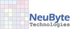

<html>
<head>
  <meta charset="UTF-8">
  <link rel="icon" type="image/x-icon" href="assets/favicon.ico?v=2">
<link rel="apple-touch-icon" href="assets/apple-touch-icon.png">
<link rel="manifest" href="assets/site.webmanifest">
  <link href="https://fonts.googleapis.com/css2?family=Manrope:wght@300;400;500;600;700&display=swap" rel="stylesheet">
 <link rel="stylesheet" href="assets/neubyte.css">
 <!--This is supposed to build as /assets/css/neubyte.css-->
</head>
<body>

  

<section style="max-width: 860px; margin: 0 auto; padding: 1rem;">
<h1>NeuByte Technologies  </h1>
<h2>Engineering Portfolio & Project Documentation</h2>

Welcome to the NeuByte Technologies portfolio.  
This site contains architecture, documentation, diagrams, and project details for ongoing and completed engineering work.

<h2> Featured Projects</h2>

<b>FitnessApp</b>
  End‑to‑end architecture, diagrams, documentation, and sprint artifacts.   
<a href="https://github.com/gordonneuls/portfolio">Portfolio  Repository</a>

<h2>Documentation</h2>

<ul>
<li>
  <a href="about.html">About NeuByte</a>
</li>
<li>
  <a href="portfolio.html">Portfolio Overview</a>
  </li>
</ul>

© NeuByte Technologies. All rights reserved.
</section>
</body>
</html>
